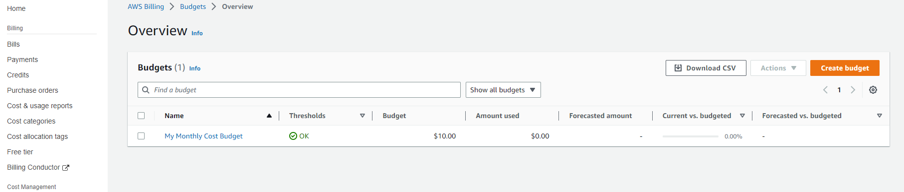

# Week 0 — Billing and Architecture

# TASKS To DO

Destroy your root account credentials, Set MFA, IAM role
Use EventBridge to hookup Health Dashboard to SNS and send notification when there is a service health issue.
Review all the questions of each pillars in the Well Architected Tool (No specialized lens)
Create an architectural diagram (to the best of your ability) the CI/CD logical pipeline in Lucid Charts
Research the technical and service limits of specific services and how they could impact the technical path for technical flexibility. 

# Tasks accomplished

- Watched all videos submitted for the bootcamp week-0

- Created new user with admin privileges

- Activated MFA for the user

- Created a budget and a billing alert

- Created security credentials for the new user

- As CLI was already installed in my environment I added new credentials and connected to AWS CLI

- Created an Event Bridge, SNS topic in order to  monitor the healthcheck and added subscription

- Reviewed well-architected tool

# Link for Logical Architectual Diagram in Lucid Charts
https://lucid.app/lucidchart/bbd859be-4bf1-4aab-99d1-8d5756c30ec0/edit?viewport_loc=-1535%2C108%2C4490%2C2243%2C0_0&invitationId=inv_da8f846a-a581-4cc6-808b-984b83654b92

# Link for Conceptual Diagram in Lucid Charts
https://lucid.app/lucidchart/22254602-a882-4e1c-83c4-bd9e0969a341/edit?viewport_loc=-11%2C-11%2C2219%2C1108%2C0_0&invitationId=inv_c8f53542-16ae-4ab9-ba68-b2243bf80d6f

