# Week 1 — App Containerization

**For this week below tasks were fulfilled**

- Containerized the Backend

- Built image and and run container

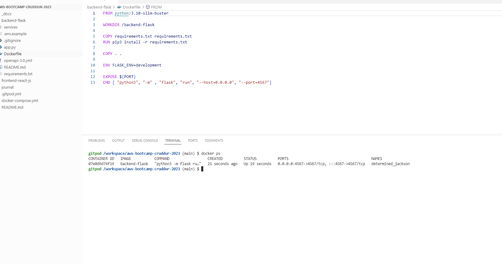
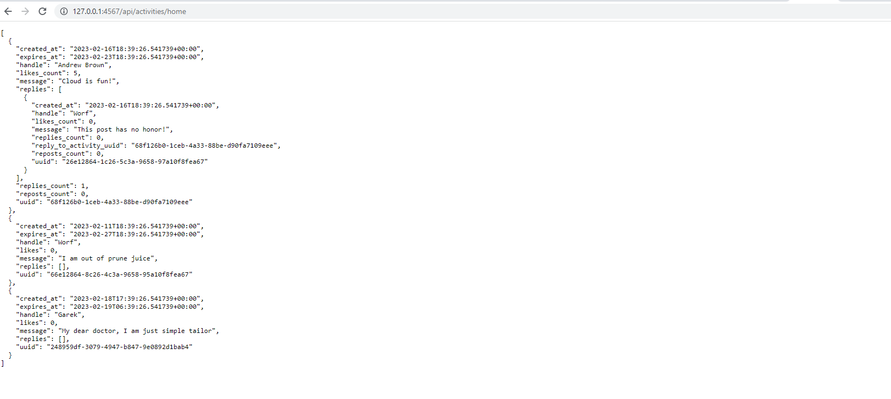

- Got Container Images or Running Container Ids

- Checked Container Logs

- Gained Access to a Container
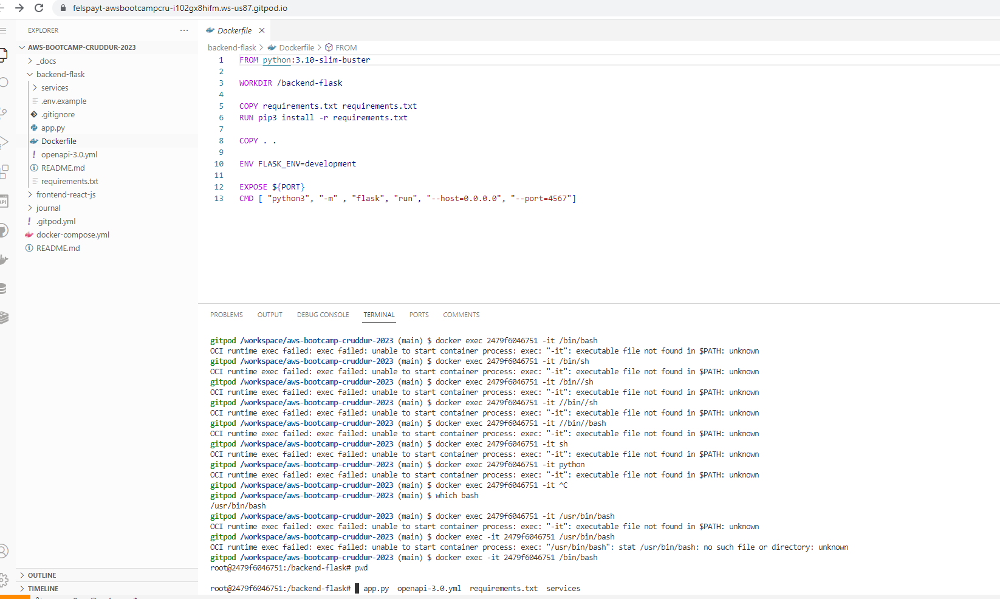

- Deleted an Image
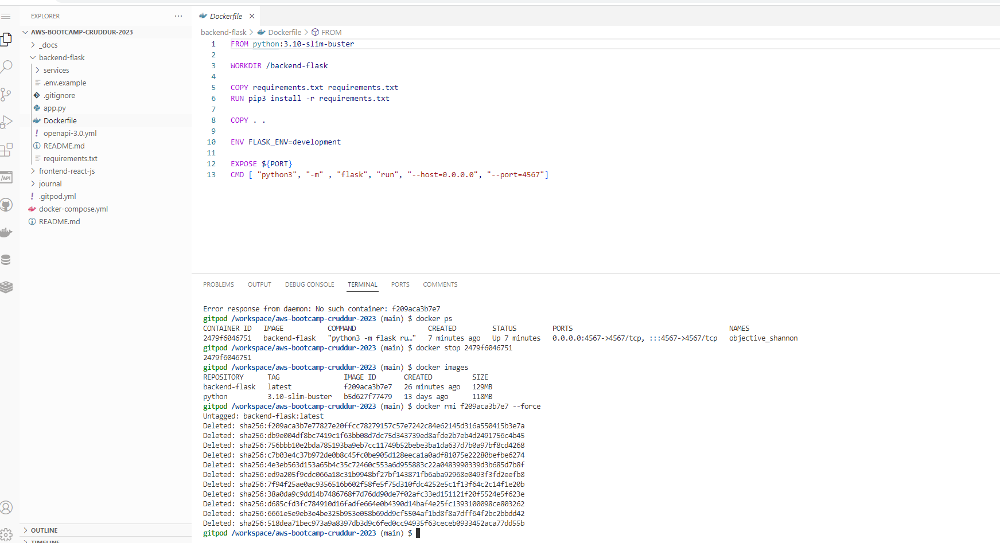

- Created a docker-compose file + Added DynamoDB Local and Postgres

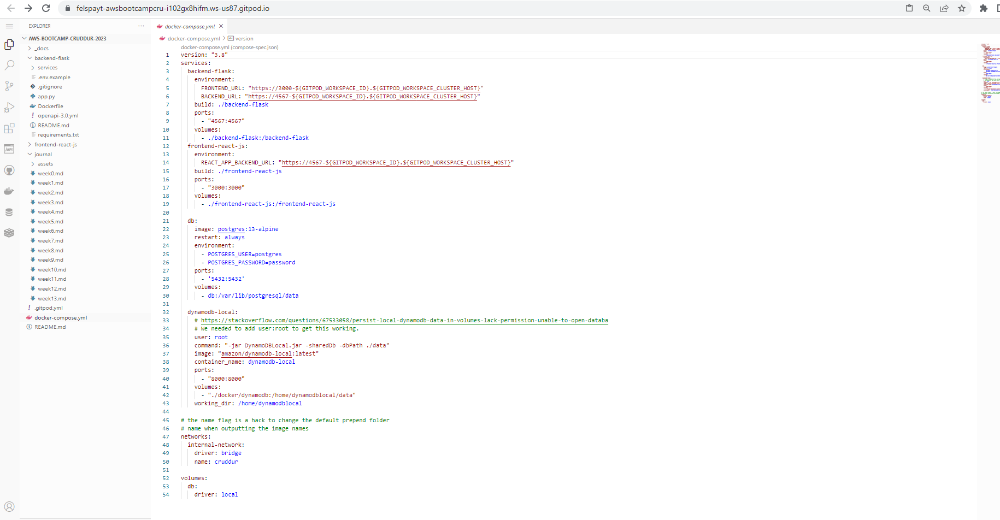

- Run compose file 
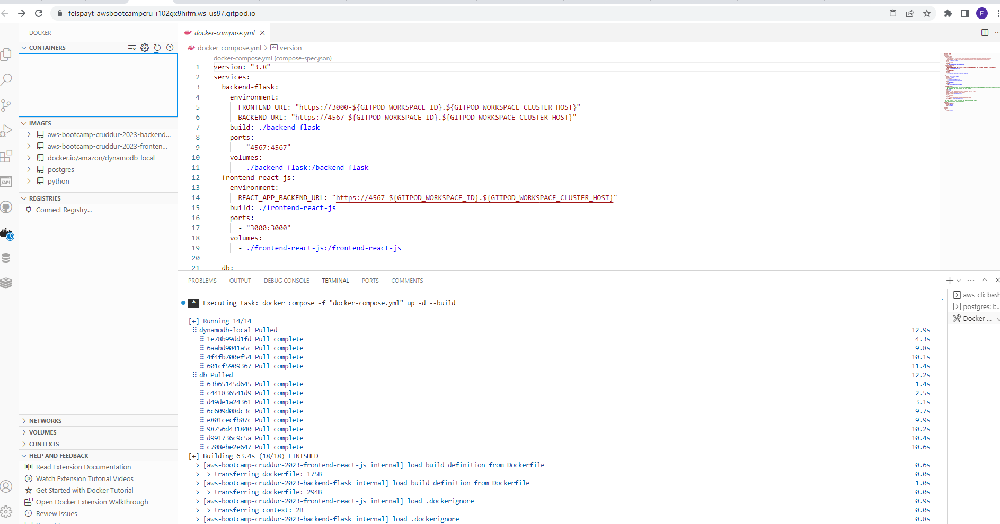

- Confiugred backend and frontent part of application for notifications section 
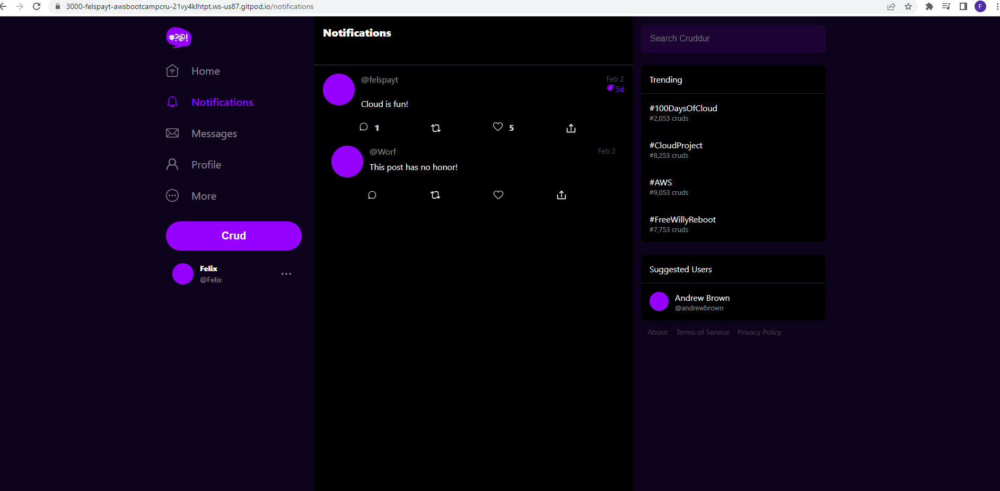
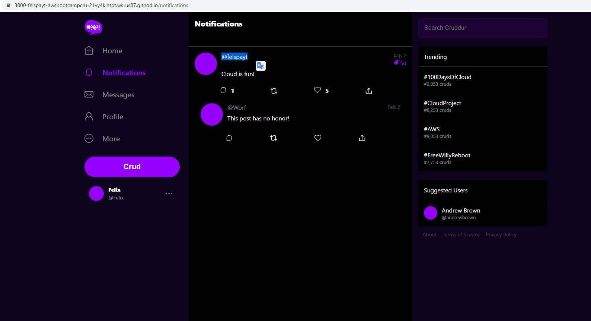

- Added DynamoDB and Postgress to docker compose file and configured/connected databases
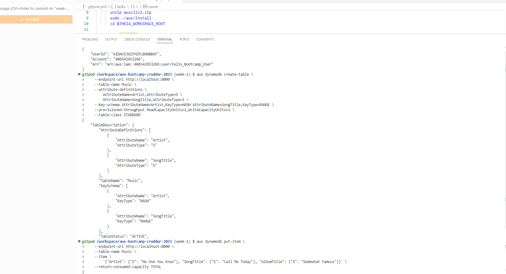
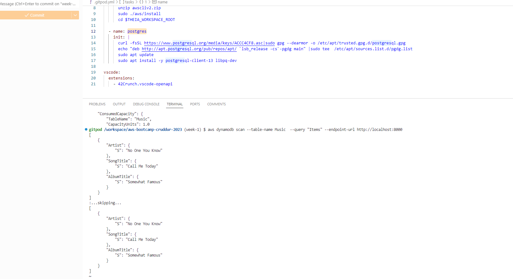
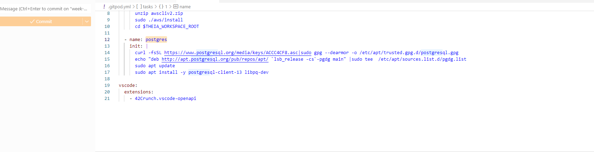
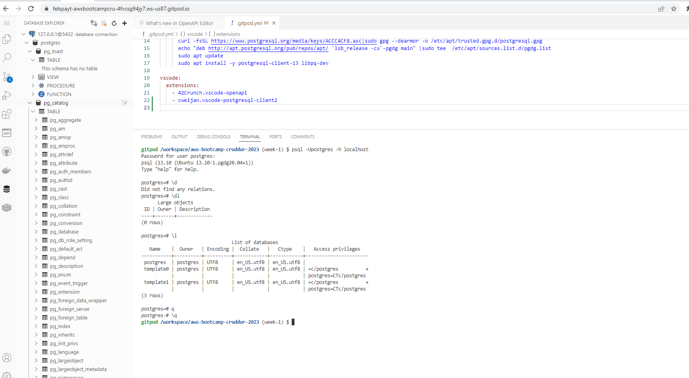
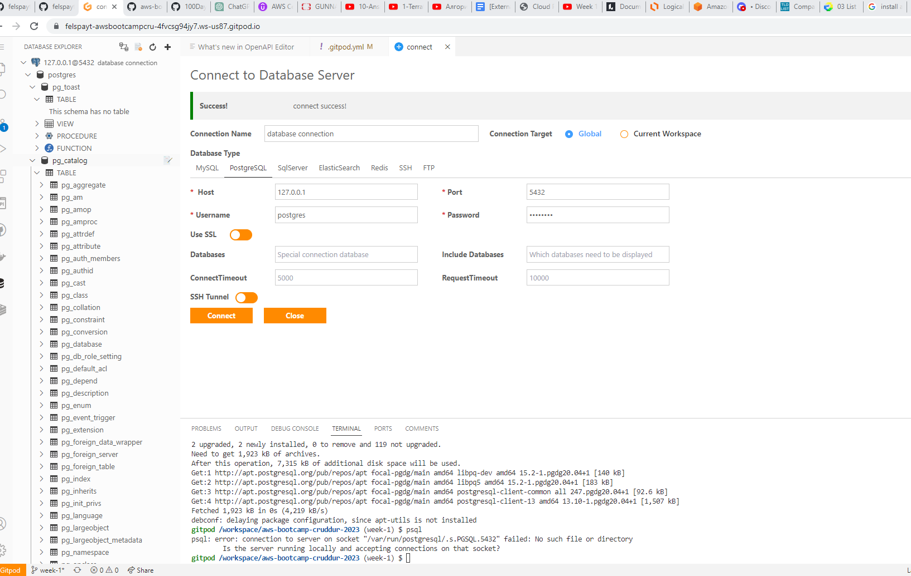
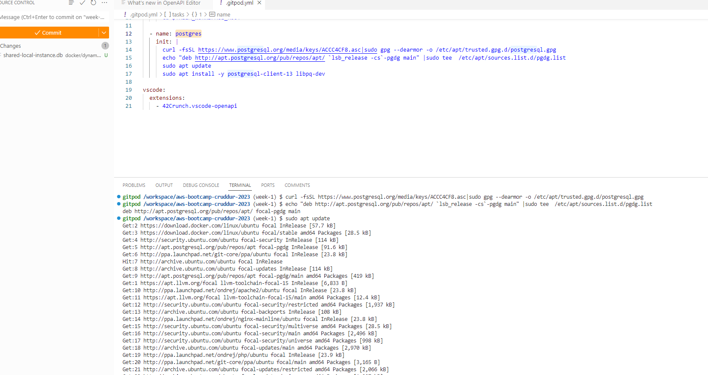

- Run the dockerfile CMD as an external script

- Pushed and taged a image to DockerHub

- Used multi-stage building for a Dockerfile build

- Implement a healthcheck in the V3 Docker compose file

- Researched best practices of Dockerfiles

- Learned how to install Docker on my localmachine and got the same containers running outside of Gitpod

- Launch an EC2 instance that has docker installed, and pull a container to demonstrate you can run your own docker processes

